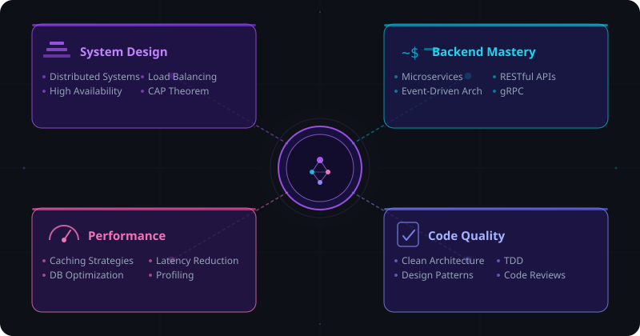

<div align="center">

<!-- ═══════════════════════════════════════════════════════════════ -->
<!-- HERO BANNER -->
<!-- ═══════════════════════════════════════════════════════════════ -->


<!-- DOODLE -->
<br/>

<br/><br/>

<!-- TYPING SVG -->
<a href="https://git.io/typing-svg">
  
</a>

<br/>

<!-- SOCIAL LINKS -->
<a href="https://www.linkedin.com/in/animesh246/">
  
</a>&nbsp;
<a href="https://animeshsrivastava.vercel.app">
  
</a>&nbsp;
<a href="https://github.com/animeshsrivastava246?tab=followers">
  
</a>&nbsp;
<a href="https://github.com/animeshsrivastava246">
  
</a>

</div>

<!-- DIVIDER -->


<!-- ═══════════════════════════ ABOUT ════════════════════════════ -->

## &nbsp;&nbsp; `whoami`

```js
const animesh = {
    role: "Software Development Engineer",
    location: "Lucknow, India",
    languages: ["Java", "Python", "TypeScript", "JavaScript", "SQL"],
    architecture: ["Microservices", "Event-Driven", "Distributed Systems"],
    currentFocus: "Building systems that handle millions of requests gracefully",
    funFact: "I debug in my dreams"
};
```

<br/>

> *"Good software should be easy to reason about, easy to extend,*
> *difficult to break, and clear enough that future-you understands it instantly."*

<br/>

<!-- DIVIDER -->


<!-- ══════════════════════ TECH STACK ═══════════════════════════ -->

## &nbsp;&nbsp; Tech DNA

<div align="center">

<!-- Using skillicons.dev for highly graphic icons -->

**`Languages`**

<a href="https://skillicons.dev">
  
</a>

<br/><br/>

**`Backend & Frameworks`**

<a href="https://skillicons.dev">
  
</a>

<br/><br/>

**`Databases & Storage`**

<a href="https://skillicons.dev">
  
</a>

<br/><br/>

**`Cloud & DevOps`**

<a href="https://skillicons.dev">
  
</a>

</div>

<!-- DIVIDER -->


<!-- ════════════════════ PINNED PROJECTS ════════════════════════ -->

## &nbsp;&nbsp; Featured Work

<div align="center">

<a href="https://github.com/animeshsrivastava246/storyteller">
  
</a>&nbsp;&nbsp;
<a href="https://github.com/animeshsrivastava246/name-the-game">
  
</a>

<br/><br/>

<a href="https://github.com/animeshsrivastava246/disney-clone">
  
</a>&nbsp;&nbsp;
<a href="https://github.com/animeshsrivastava246/Job-Listing">
  
</a>

<br/><br/>

<a href="https://github.com/animeshsrivastava246/chatty">
  
</a>&nbsp;&nbsp;
<a href="https://github.com/animeshsrivastava246/animeshsrivastava">
  
</a>

</div>

<!-- DIVIDER -->


<!-- ═══════════════════ GITHUB ANALYTICS ════════════════════════ -->

## &nbsp;&nbsp; Performance Metrics

<div align="center">


<br/><br/>


<br/><br/>


</div>

<!-- DIVIDER -->


<!-- ═══════════════════════ TROPHIES ════════════════════════════ -->

## &nbsp;&nbsp; Achievements

<div align="center">


</div>

<!-- DIVIDER -->


<!-- ═══════════════════ FOCUS MINDMAP ═══════════════════════════ -->

## &nbsp;&nbsp; Engineering Focus

<div align="center">

</div>

<!-- DIVIDER -->


<!-- ═══════════════════ PHILOSOPHY ══════════════════════════════ -->

## &nbsp;&nbsp; Engineering Principles

<div align="center">

</div>

<!-- DIVIDER -->


<!-- ═══════════════════ CONNECT ═════════════════════════════════ -->

<div align="center">

<br/>

### &nbsp; `> connect --with animesh`

<br/>

<a href="mailto:animeshsrivastava246246@gmail.com">
  
</a>&nbsp;
<a href="https://www.linkedin.com/in/animesh246/">
  
</a>&nbsp;
<a href="https://animeshsrivastava.vercel.app">
  
</a>

<br/><br/>


</div>
